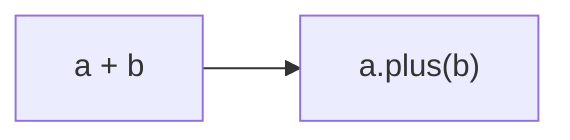
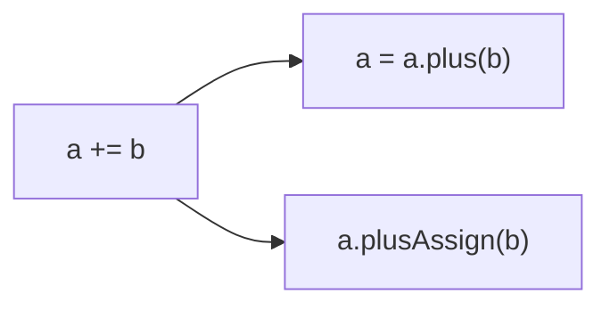
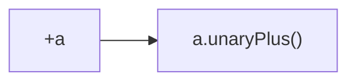

# 7장. 연산자 오버로딩과 기타 관례  

## 입구
- 연산자 오버로딩
- 관례: 여러 연산을 지원하기 위해 특별한 이름이 붙은 메소드
- 위임 프로퍼티

자바에는 표준 라이브러리와 밀접하게 연관된 언어 기능이 몇 가지 있다.
이와 비슷하게 코틀린에서도 어떤 언어 기능이 정해진 사용자 작성 함수와 연결되는 경우가 몇 가지 있는데, 
코틀린에서는 이런 언어 기능이 어떤 타입(클래스)과 연관되기보다는 **특정 함수 이름과 연관**된다. 
예를 들어 어떤 클래스안에 plus라는 이름의 메소드를 정의하면 그 클래스 인스턴스에 대해 `+` 연산자를 사용할 수 있다. 
이런 식으로 <span style="color:orange">어떤 언어 기능과 미리 정해진 이름의 함수를 연결해주는 기법을 
코틀린에서 `관례`(covention)</span>이라 부른다.

언어 기능을 타입에 의존하는 자바와 달리 코틀린은 함수 이름을 통한 관례에 의존. 
이런 관례를 채택한 이유는 **기존 자바 클래스를 코틀린 언어에 적용하기 위함**이다. 
- 기존 자바 클래스가 구현하는 인터페이스는 이미 고정되있어서 
  코틀린 쪽에서 자바 클래스가 새로운 인터페이스를 구현하게 만들 수 없다. 
- 반면 확장 함수를 사용하면 기존 클래스에 새로운 메소드를 추가할 수 있어서, 
  기존 자바 클래스에 대해 확장 함수를 구현하면서 관례에 따라 이름을 붙이면 
  기존 자바 코드를 바꾸지 않아도 새로운 기능을 쉽게 부여할 수 있다.


<br/>
<br/>


## 7.1. 산술 연산자 오버로딩

코틀린에서 관례를 사용하는 가장 단순한 예는 산술 연산자. 
자바에서는 원시 타입에만 산술 연산자를 사용할 수 있고, 
추가로 String에 대해 + 연산자를 사용할 수 있다. 

그러나 다른 클래스에서도 산술 연산자가 유용할 수 있다. 
예를 들어 BigInteger 클래스에 add 메소드를 명시적으로 호출하기 보다 
`+` 연산자를 사용하는 편이 더 낫고, 컬렉션에 원소를 추가하더라도 `+=` 연산자를 사용하면 편리하다. 
코틀린에서는 이러한 일이 가능하다.

<br/>


## 7.1.1. 이항 산술 연산 오버로딩

아래 연산은 두 점의 X좌표와 Y 좌표를 각각 더하는데, `+` 연산자를 구현하여 만든다.

```kotlin
data class Point(val x: Int, val y: Int) {
    operator fun plus(other: Point): Point {
        return Point(x + other.x, y + other.y)
    }
}

>>> val p1 = Point(10, 20)
>>> val p2 = Point(30, 40)
>>> println(p1 + p2)
Point(x=40, y=60)
```

plus 함수 앞에 `operator` 키워드가 있는데, 연산자를 오버로딩 하는 함수 앞에는 꼭 operator가 있어야 한다. 
operator 키워드를 붙임으로써 **어떤 함수가 관례를 따르는 함수임을 명확히 할 수** 있다. 
(아래 다이어그램) + 연산자는 plus 함수 호출로 컴파일 된다.



그리고 연산자를 멤버 함수로 만드는 대신 **확장 함수로 정의**할 수도 있다. 
외부 함수의 클래스에 대한 연산자를 정의할 때는 관례를 따르는 이름의 확장 함수로 구현하는게 일반적인 패턴.

다른 언어와 비교해 코틀린에서 오버로딩한 연산자를 정의하고 사용하기 더 쉬운데, 
코틀린에서는 프로그래머가 직접 연산자를 만들어 사용할 수 없고 언어에서 미리 정해둔 연산자만 오버로딩할 수 있으며, 
관례에 따르기 위해 클래스에서 정의해야 하는 이름이 연산자별로 정해져 있다. 
아래는 이항 연산자와 그에 상응하는 연산자 함수 이름을 보여준다.

|식|함수 이름|
|------|---|
|a * b|times|
|a / b|div|
|a % b|mod(1.1부터 rem)|
|a + b|plus|
|a - b|minus|

직접 정의한 함수를 통해 구현하더라도 연산자 우선순위는 언제나 표준 숫자 타입에 대한 연산자 우선순위와 같다.

> ### ✅연산자 함수와 자바
> 코틀린 연산자를 자바에서 호출하기 쉽다. 모든 오버로딩한 연산자는 함수로 정의되며, 
> 긴 이름(FQN)을 사용하면 일반 함수로 호출할 수 있다. 만약 자바 클래스에 원하는 연산자 기능을 제공하는 메소드가 이미 있지만, 
> 이름이 다르다면 관례에 맞는 이름을 가진 확장 함수를 작성하고 연산을 기존 자바 메소드에 위임하면 된다.

연산자를 정의할 때, 두 피연산자는(연산자 함수의 두 파라미터) 같은 타입일 필요는 없다.

```kotlin
operator fun Point.times(scale: Double) 
    = Point((x*scale).toInt(), (y * scale).toInt())

>>> println(p1 * 1.5)
Point(x=15, y=30)
```

연산자 함수의 반환 타입이 두 피연산자 중 하나와 일치하지 않아도 된다.

```kotlin
operator fun Char.times(count: Int) = toString().repeat(count)

>>> println('a' * 3)
aaa
```

일반 함수와 마찬가지로 operator 함수도 오버로딩 가능하다. 
따라서 이름은 같지만 파라미터 타입이 서로 다른 연산자 함수를 여럿 만들 수 있다.
대신 operator 함수는 파라미터의 개수는 1개밖에 정의하지 못한다. 이항 연산이기 때문!

> ### ✅비트 연산자에 대해 특별한 연산자 함수를 사용하지 않는다.
> 코틀린은 표준 숫자 타입에 대해 비트 연산자를 정의하지 않는다. 
> 따라서 커스텀 타입에서 비트 연산자를 정의할 수도 없다.
> 대신, 중위 연산자 표기법을 지원하는 일반 함수를 사용해 비트 연산을 수행한다.
> - shl - 왼쪽 시프트(자바 <<)
> - shr - 오른쪽 시프트(부호 비트 유지, 자바 >>)
> - ushr - 오른쪽 시프트(0으로 부호 비트 설정, 자바 >>>)
> - and - 비트 곱(자바 &)
> - or - 비트 합(자바 |)
> - xor - 비트 배타 합(자바 ^)
> - inv - 비트 반전(자바 ~)


<br/>


## 7.1.2. 복합 대입 연산자 오버로딩

코틀린은 + 연산자 뿐 아니라 `+=`, `-=` 등 복합 대입 연산자도 지원한다.

```kotlin
var point = Point(1,2)
point += Point(3,4)
println(point)

// Result
Point(x=4, y=6)
```

`+=` 연산이 객체에 대한 참조를 다른 참조로 바꾸기보다 원래 객체의 내부 상태를 변경하게 만들고 싶을 때가 있다.
변경가능한 컬렉션에 원소를 추가하는 경우가 대표적인 예.

> ### ✅객체에 대한 참조를 다른 참조로 바꾸기
> point = point + Point(3,4)의 실행을 살펴보자. point의 plus는 새로운 객체를 반환한다.
> point + Point(3,4)는 두 점의 좌표 각각 더한 값을 좌표로 갖는 새로운 Point 객체를 반환한다. 
> 그 후 대입이 이뤄지면 point 변수는 새로운 Point 객체를 가리키게 된다.

```kotlin
val numbers = ArrayList<Int>()
numbers += 42
println(numbers[0])
```

반환 타입이 Unit인 plusAssign 함수를 정의하면 코틀린은 += 연산자에 그 함수를 사용한다. 
다른 복합 연산자 함수도 비슷하게 minusAssign, timesAssign 등의 이름을 사용한다. 
코틀린 표준 라이브러리는 변경 가능한 컬렉션에 대해 plusAssign을 정의하며 앞의 컬렉션에 원소를 추가하는 경우가 그렇다.

```kotlin
operator fun <T> MutableCollection<T>.plusAssign(element: T){
    this.add(element)
}
```



+=를 plus와 plusAssign 양쪽으로 컴파일 할 수 있다. 
어떤 클래스가 이 두 함수를 모두 정의하고 둘 다 +=에 사용 가능한 경우 컴파일러는 오류를 보여준다.
일반 연산자를 이용해 해결하거나 var를 val로 바꿔서 plusAssign 적용을 불가능하게 할 수도 있다.
하지만, 일반적으로 새로운 클래스를 일관성 있게 설계하는 게 가장 좋다. 
**plus와 plusAssign을 동시에 정의하는 것을 피해야 한다.**

코틀린은 컬렉션에 대해 두 가지 접근 방법을 제공한다.
- +, -는 항상 새로운 컬렉션을 반환한다.
- +=, -= 연산자는 항상 변경 가능한 컬렉션에 작용해 메모리에 있는 객체 상태를 변화시킨다.
- 또한, 읽기 전용 컬렉션에서 +=, -=는 변경을 적용한 복사본을 반환한다.\
  (따라서 var로 선언한 변수가 가리키는 읽기 전용 컬렉션에만 +=와 -=를 적용할 수 있다)

이런 연산자의 피연산자로 개별 원소를 사용하거나 원소 타입이 일치하는 다른 컬렉션을 사용할 수 있다.

```kotlin
val list = arrayListOf(1,2)
list += 3 // 변경 가능한 컬렉션 list에 대해 +=을 통해 객체 상태를 변경.
val newList = list + listOf(4,5) // 두 리스트를 +로 합쳐 새로운 리스트를 반환.
println(list)
println(newList)

// Result
[1, 2, 3]
[1, 2, 3, 4, 5]
```

<br/>


## 7.1.3. 단항 연산자 오버로딩

이항 연산자의 오버로딩과 마찬가지로 미리 정해진 이름의 함수를 멤버나 확장 함수로 선언하면서 operator를 표시하면 된다.

```kotlin
// 단항 minus 함수는 파라미터가 없다
operator fun Point.unaryMinus(): Point {
  // 좌표에서 각 성분의 음수를 취한 새 점을 반환한다
  return Point(-x, -y)
}

val p = Point(10, 20)
println(-p)

// Result
Point(x=-10, y=-20)
```

단항 연산자를 오버로딩하기 위해 사용하는 함수는 인자를 취하지 않는다.



단항 + 연산자는 unaryPlus 호출로 반환된다.

|식|함수 이름|
|------|---|
|+a|unaryPlus|
|-a|unaryMinus|
|!a|not|
|++a, a++|inc|
|--a, a--|dec|

inc나 dec 함수를 정의해 증가/감소 연산자를 오버로딩하는 경우 
컴파일러는 일반적인 값에 대한 전위와 후위 증가/감소 연산자와 같은 의미를 제공. 
아래의 예제는 BigDecimal 클래스에서 ++를 오버로딩하는 모습을 보여준다.

```kotlin
operator fun BigDecimal.inc() = this + BigDecimal.ONE

var bd = BigDecimal.ZERO
// 후위 증가 연산은 println이 실행된 다음 값을 증가
println(bd++)
// 전위 증가 연산은 println이 실행되기 전 값을 증가
println(++bd)
```


<br/>


## 7.2. 비교 연산자 오버로딩


<br/>


## 7.2.


<br/>


## 7.2.


<br/>


## 7.2.


<br/>


## 7.2.


<br/>


## 7.2.


<br/>


## 7.2.


<br/>


> ### ✅


<span style="color:orange">xxxx</span>


<br/>
<br/>
<br/>
<br/>