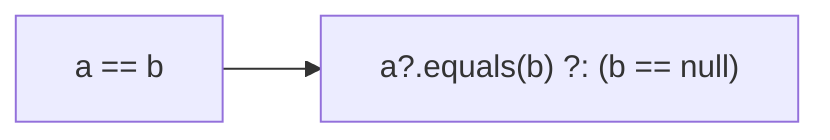
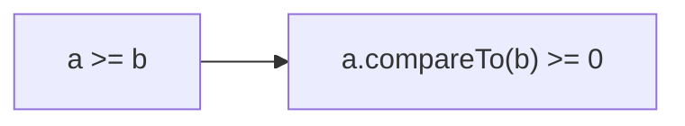
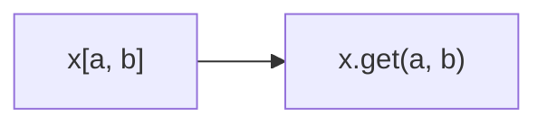
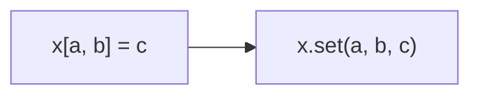
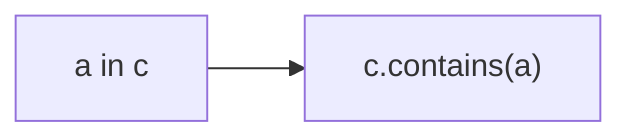
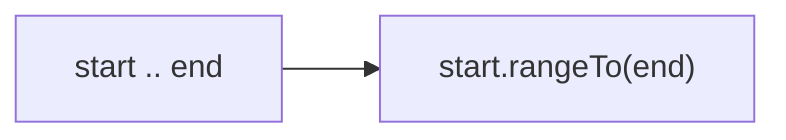

# 7장. 연산자 오버로딩과 기타 관례  

## 입구
- 연산자 오버로딩
- 관례: 여러 연산을 지원하기 위해 특별한 이름이 붙은 메소드
- 위임 프로퍼티

자바에는 표준 라이브러리와 밀접하게 연관된 언어 기능이 몇 가지 있다.
이와 비슷하게 코틀린에서도 어떤 언어 기능이 정해진 사용자 작성 함수와 연결되는 경우가 몇 가지 있는데, 
코틀린에서는 이런 언어 기능이 어떤 타입(클래스)과 연관되기보다는 **특정 함수 이름과 연관**된다. 
예를 들어 어떤 클래스안에 plus라는 이름의 메소드를 정의하면 그 클래스 인스턴스에 대해 `+` 연산자를 사용할 수 있다. 
이런 식으로 <span style="color:orange">어떤 언어 기능과 미리 정해진 이름의 함수를 연결해주는 기법을 
코틀린에서 `관례`(covention)</span>이라 부른다.

언어 기능을 타입에 의존하는 자바와 달리 코틀린은 함수 이름을 통한 관례에 의존. 
이런 관례를 채택한 이유는 **기존 자바 클래스를 코틀린 언어에 적용하기 위함**이다. 
- 기존 자바 클래스가 구현하는 인터페이스는 이미 고정되있어서 
  코틀린 쪽에서 자바 클래스가 새로운 인터페이스를 구현하게 만들 수 없다. 
- 반면 확장 함수를 사용하면 기존 클래스에 새로운 메소드를 추가할 수 있어서, 
  기존 자바 클래스에 대해 확장 함수를 구현하면서 관례에 따라 이름을 붙이면 
  기존 자바 코드를 바꾸지 않아도 새로운 기능을 쉽게 부여할 수 있다.


<br/>
<br/>


## 7.1. 산술 연산자 오버로딩

코틀린에서 관례를 사용하는 가장 단순한 예는 산술 연산자. 
자바에서는 원시 타입에만 산술 연산자를 사용할 수 있고, 
추가로 String에 대해 + 연산자를 사용할 수 있다. 

그러나 다른 클래스에서도 산술 연산자가 유용할 수 있다. 
예를 들어 BigInteger 클래스에 add 메소드를 명시적으로 호출하기 보다 
`+` 연산자를 사용하는 편이 더 낫고, 컬렉션에 원소를 추가하더라도 `+=` 연산자를 사용하면 편리하다. 
코틀린에서는 이러한 일이 가능하다.

<br/>


## 7.1.1. 이항 산술 연산 오버로딩

아래 연산은 두 점의 X좌표와 Y 좌표를 각각 더하는데, `+` 연산자를 구현하여 만든다.

```kotlin
data class Point(val x: Int, val y: Int) {
    operator fun plus(other: Point): Point {
        return Point(x + other.x, y + other.y)
    }
}

>>> val p1 = Point(10, 20)
>>> val p2 = Point(30, 40)
>>> println(p1 + p2)
Point(x=40, y=60)
```

plus 함수 앞에 `operator` 키워드가 있는데, 연산자를 오버로딩 하는 함수 앞에는 꼭 operator가 있어야 한다. 
operator 키워드를 붙임으로써 **어떤 함수가 관례를 따르는 함수임을 명확히 할 수** 있다. 
(아래 다이어그램) + 연산자는 plus 함수 호출로 컴파일 된다.


그리고 연산자를 멤버 함수로 만드는 대신 **확장 함수로 정의**할 수도 있다. 
외부 함수의 클래스에 대한 연산자를 정의할 때는 관례를 따르는 이름의 확장 함수로 구현하는게 일반적인 패턴.

다른 언어와 비교해 코틀린에서 오버로딩한 연산자를 정의하고 사용하기 더 쉬운데, 
코틀린에서는 프로그래머가 직접 연산자를 만들어 사용할 수 없고 언어에서 미리 정해둔 연산자만 오버로딩할 수 있으며, 
관례에 따르기 위해 클래스에서 정의해야 하는 이름이 연산자별로 정해져 있다. 
아래는 이항 연산자와 그에 상응하는 연산자 함수 이름을 보여준다.

|식|함수 이름|
|------|---|
|a * b|times|
|a / b|div|
|a % b|mod(1.1부터 rem)|
|a + b|plus|
|a - b|minus|

직접 정의한 함수를 통해 구현하더라도 연산자 우선순위는 언제나 표준 숫자 타입에 대한 연산자 우선순위와 같다.

> ### ✅연산자 함수와 자바
> 코틀린 연산자를 자바에서 호출하기 쉽다. 모든 오버로딩한 연산자는 함수로 정의되며, 
> 긴 이름(FQN)을 사용하면 일반 함수로 호출할 수 있다. 만약 자바 클래스에 원하는 연산자 기능을 제공하는 메소드가 이미 있지만, 
> 이름이 다르다면 관례에 맞는 이름을 가진 확장 함수를 작성하고 연산을 기존 자바 메소드에 위임하면 된다.

연산자를 정의할 때, 두 피연산자는(연산자 함수의 두 파라미터) 같은 타입일 필요는 없다.

```kotlin
operator fun Point.times(scale: Double) 
    = Point((x*scale).toInt(), (y * scale).toInt())

>>> println(p1 * 1.5)
Point(x=15, y=30)
```

연산자 함수의 반환 타입이 두 피연산자 중 하나와 일치하지 않아도 된다.

```kotlin
operator fun Char.times(count: Int) = toString().repeat(count)

>>> println('a' * 3)
aaa
```

일반 함수와 마찬가지로 operator 함수도 오버로딩 가능하다. 
따라서 이름은 같지만 파라미터 타입이 서로 다른 연산자 함수를 여럿 만들 수 있다.
대신 operator 함수는 파라미터의 개수는 1개밖에 정의하지 못한다. 이항 연산이기 때문!

> ### ✅비트 연산자에 대해 특별한 연산자 함수를 사용하지 않는다.
> 코틀린은 표준 숫자 타입에 대해 비트 연산자를 정의하지 않는다. 
> 따라서 커스텀 타입에서 비트 연산자를 정의할 수도 없다.
> 대신, 중위 연산자 표기법을 지원하는 일반 함수를 사용해 비트 연산을 수행한다.
> - shl - 왼쪽 시프트(자바 <<)
> - shr - 오른쪽 시프트(부호 비트 유지, 자바 >>)
> - ushr - 오른쪽 시프트(0으로 부호 비트 설정, 자바 >>>)
> - and - 비트 곱(자바 &)
> - or - 비트 합(자바 |)
> - xor - 비트 배타 합(자바 ^)
> - inv - 비트 반전(자바 ~)


<br/>


## 7.1.2. 복합 대입 연산자 오버로딩

코틀린은 + 연산자 뿐 아니라 `+=`, `-=` 등 복합 대입 연산자도 지원한다.

```kotlin
var point = Point(1,2)
point += Point(3,4)
println(point)

// Result
Point(x=4, y=6)
```

`+=` 연산이 객체에 대한 참조를 다른 참조로 바꾸기보다 원래 객체의 내부 상태를 변경하게 만들고 싶을 때가 있다.
변경가능한 컬렉션에 원소를 추가하는 경우가 대표적인 예.

> ### ✅객체에 대한 참조를 다른 참조로 바꾸기
> point = point + Point(3,4)의 실행을 살펴보자. point의 plus는 새로운 객체를 반환한다.
> point + Point(3,4)는 두 점의 좌표 각각 더한 값을 좌표로 갖는 새로운 Point 객체를 반환한다. 
> 그 후 대입이 이뤄지면 point 변수는 새로운 Point 객체를 가리키게 된다.

```kotlin
val numbers = ArrayList<Int>()
numbers += 42
println(numbers[0])
```

반환 타입이 Unit인 plusAssign 함수를 정의하면 코틀린은 += 연산자에 그 함수를 사용한다. 
다른 복합 연산자 함수도 비슷하게 minusAssign, timesAssign 등의 이름을 사용한다. 
코틀린 표준 라이브러리는 변경 가능한 컬렉션에 대해 plusAssign을 정의하며 앞의 컬렉션에 원소를 추가하는 경우가 그렇다.

```kotlin
operator fun <T> MutableCollection<T>.plusAssign(element: T){
    this.add(element)
}
```


+=를 plus와 plusAssign 양쪽으로 컴파일 할 수 있다. 
어떤 클래스가 이 두 함수를 모두 정의하고 둘 다 +=에 사용 가능한 경우 컴파일러는 오류를 보여준다.
일반 연산자를 이용해 해결하거나 var를 val로 바꿔서 plusAssign 적용을 불가능하게 할 수도 있다.
하지만, 일반적으로 새로운 클래스를 일관성 있게 설계하는 게 가장 좋다. 
**plus와 plusAssign을 동시에 정의하는 것을 피해야 한다.**

코틀린은 컬렉션에 대해 두 가지 접근 방법을 제공한다.
- +, -는 항상 새로운 컬렉션을 반환한다.
- +=, -= 연산자는 항상 변경 가능한 컬렉션에 작용해 메모리에 있는 객체 상태를 변화시킨다.
- 또한, 읽기 전용 컬렉션에서 +=, -=는 변경을 적용한 복사본을 반환한다.\
  (따라서 var로 선언한 변수가 가리키는 읽기 전용 컬렉션에만 +=와 -=를 적용할 수 있다)

이런 연산자의 피연산자로 개별 원소를 사용하거나 원소 타입이 일치하는 다른 컬렉션을 사용할 수 있다.

```kotlin
val list = arrayListOf(1,2)
list += 3 // 변경 가능한 컬렉션 list에 대해 +=을 통해 객체 상태를 변경.
val newList = list + listOf(4,5) // 두 리스트를 +로 합쳐 새로운 리스트를 반환.
println(list)
println(newList)

// Result
[1, 2, 3]
[1, 2, 3, 4, 5]
```

<br/>


## 7.1.3. 단항 연산자 오버로딩

이항 연산자의 오버로딩과 마찬가지로 미리 정해진 이름의 함수를 멤버나 확장 함수로 선언하면서 operator를 표시하면 된다.

```kotlin
// 단항 minus 함수는 파라미터가 없다
operator fun Point.unaryMinus(): Point {
  // 좌표에서 각 성분의 음수를 취한 새 점을 반환한다
  return Point(-x, -y)
}

val p = Point(10, 20)
println(-p)

// Result
Point(x=-10, y=-20)
```

단항 연산자를 오버로딩하기 위해 사용하는 함수는 인자를 취하지 않는다.


단항 + 연산자는 unaryPlus 호출로 반환된다.

|식|함수 이름|
|------|---|
|+a|unaryPlus|
|-a|unaryMinus|
|!a|not|
|++a, a++|inc|
|--a, a--|dec|

inc나 dec 함수를 정의해 증가/감소 연산자를 오버로딩하는 경우 
컴파일러는 일반적인 값에 대한 전위와 후위 증가/감소 연산자와 같은 의미를 제공. 
아래의 예제는 BigDecimal 클래스에서 ++를 오버로딩하는 모습을 보여준다.

```kotlin
operator fun BigDecimal.inc() = this + BigDecimal.ONE

var bd = BigDecimal.ZERO
// 후위 증가 연산은 println이 실행된 다음 값을 증가
println(bd++)
// 전위 증가 연산은 println이 실행되기 전 값을 증가
println(++bd)
```


<br/>


## 7.2. 비교 연산자 오버로딩

equals, compareTo를 호출해야 하는 자바와 달리 
코틀린에서는 == 비교 연산자를 직접 사용함으로써 코드가 간결하며 이해하기 쉬운 장점이 있다.

<br/>


## 7.2.1. 동등성 연산자 : equals

!= 연산자도 equals로 컴파일된다. 이는 비교 결과를 뒤집은 값을 결과값으로 사용한다.
==와 !=는 내부에서 인자가 널인지 검사하므로 다른 연산과 달리 널이 될 수 있는 값에도 적용할 수 있다.

a가 널인지 판단해서 널이 아닌 경우에만 a.equals(b)를 호출한다.
만약 a가 널이라면 b도 널인 경우에만 결과가 true가 된다.



동등성 검사 `==`는 equals 호출과 널 검사로 컴파일된다.

Point는 data class이므로 컴파일러가 자동으로 equals를 생성해준다.

```kotlin
class Point(val x: Int, val y: Int){
  // Any에 정의된 메소드 오버라이딩
  override equals(obj: Any?): Boolean {
    // 최적화 : 파라미터가 this와 같은 객체인지
    if(this === obj) return true
    // 파라미터 타입 검사
    if(obj !is Point) return false
    // Point로 스마트 캐스트해서 x와 y 프로퍼티에 접근
    return x == obj.x && y == obj.y
  }
}

println(Point(1, 2) == Point(1, 2)) // true 
println(Point(1, 2) != Point(4, 5)) // true 
println(null == Point(3, 2)) // false
```

`===`(식별자 비교 연산자)를 사용해 equals의 파라미터가 수신 객체와 같은지 확인한다. ===는 자바의 == 연산자와 같다. 
따라서 ===는 자신의 두 피연산자가 서로 같은 객체를 가리키는지(원시 타입인 경우 두 값이 같은지) 비교한다.

===를 사용해 자기 자신과의 비교를 최적화하는 경우가 많으며, ===는 오버로딩할 수 없다.
Any의 equals에는 operator가 붙어있지만 그 메소드를 오버라이드하는 하위 클래스의 메소드 앞에는 
operator를 붙이지 않아도 자동으로 상위 클래스의 operator 지정이 적용된다. 

또한, Any에서 상속받은 equals가 확장 함수보다 우선순위가 높기 때문에 equals를 확장 함수로 정의할 수 없다.

`!=`는 equals의 반환 값에 반전을 하여 값을 돌려준다. 즉, 개발자 따로 정의할 필요가 없다.


<br/>


## 7.2.2. 순서 연산자 : compareTo

자바에서 정렬이나 최댓값, 최솟값 등 값을 비교하는 알고리즘에 사용할 클래스는 `Comparable` 인터페이스를 구현한다.
코틀린도 똑같은 Comparable 인터페이스를 지원한다. 

게다가 코틀린은 Comparable 인터페이스 안에 있는 `compareTo` 메소드를 호출하는 관례를 제공한다.
따라서 비교 연산자(<, >, <=, >=)는 compareTo 호출로 컴파일 된다.
반환값은 Int이다. 다른 비교 연산자도 동일한 방식으로 동작한다.



```kotlin
class Person(val firstName: String, val lastName: String): Comparable<Person>{
    override fun compareTo(other: Person): Int {
        // 인자로 받은 함수를 차례로 호출하면서 값을 비교한다
        return compareValuesBy(this, other, Person::lastName, Person::firstName)
    }
}

val person1 = Person("Alice", "Smith")
val person2 = Person("Bob", "Johnson")
println(person1 < person2)

// Result
false
```

여기서 저의한 Person 객체의 Comparable 인터페이스를 코틀린뿐 아니라 자바 쪽의 컬렉션 정렬 메소드 등에도 사용할 수 있다.
equals와 마찬가지로 Comparable의 compareTo에도 operator 변경자가 붙어있으므로 
하위 클래스의 오버라이딩 함수에 operator를 붙일 필요가 없다.

`compareValuesBy`는 두 개의 객체와 여러 비교 함수를 인자로 받는다. 
첫 번째 비교 함수에 두 객체를 넘겨 값을 비교 후 같지 않다면 그 결과를 반환하고
같다면 두 번째 비교 함수를 이용하여 비교한다.
이렇게 지정한 비교함수를 지속적으로 비교한다. 만약 모든 비교 함수가 0을 반환하면 최종으로 0을 반환한다.

필드를 직접 비교하면 코드는 조금 더 복잡해지긴 하지만 비교 속도는 훨씬 빠르다.
코드를 작성할 때 일반적으로 이해하기 쉽게 코드를 작성하고 
나중에 그 코드가 얼마나 자주 호출됨에 따라 성능에 문제가 발생한다면 그때 성능을 개선한다.

```kotlin
println("abc" > "def")
```


<br/>


## 7.3. 컬렉션과 범위에 대해 쓸 수 있는 관례

컬렉션을 다룰 때 가장 많이 쓰는 연산은 인덱스를 사용해 원소를 읽거나 쓰는 연산과 
어떤 값이 컬렉션에 포함되어 있는지 확인하는 연산이다.

이 연산들을 연산자 구문으로 사용할 수 있다. 
인덱스를 사용해 원소를 설정하거나 가져오고 싶을 때는 `a[b]`라는 식을 사용한다.
(이를 <span style="color:orange">인덱스 연산자</span>라고 부른다.) 
in 연산자는 원소가 컬렉션이나 범위에 속하는지 검사하거나 컬렉션에 있는 원소를 이터레이션할 때 사용합니다.

<br/>


## 7.3.1. 인덱스로 원소에 접근: get과 set

코틀린에서 맵의 원소에 접근할 때나 자바에서 배열 원소에 접근할 때 모두 각괄호([ ])를 사용한다는 사실을 알고 있다.
같은 연산자를 사용해 변경 가능 맵에 키/값 쌍을 넣거나 이미 맵에 들어있는 키/값 연관 관계를 변경할 수 있다.

```kotlin
val value = map[key]

mutablaMap[key] = newValue
```

코틀린에서는 인덱스 연산자도 관례를 따른다.
인덱스 연산자를 사용해 원소를 읽는 연산은 get으로 변환되고 원소를 쓰는 연산은 set으로 변환된다.
Map과 MutableMap 인터페이스에는 get, set 연산자 메소드가 이미 들어있다.

```kotlin
// get 연산자 함수를 정의한다
operator fun Point.get(index: Int): Int{
    return when(index){
        // 주어진 인덱스에 해당하는 좌표를 찾는다
        0 -> x
        1 -> y
        else -> throw IndexOutOfBoundsException("Invalid coordinate $index")
    }
}

val p = Point(10,20)
println(p[1])

// 결과
20
```

get 매소드를 만들고 operator 변경자를 붙이면 된다.
p[1]이라는 식은 p가 Point 타입인 경우 방금 정의한 get 메소드로 변환된다.


각괄호를 사용한 접근은 get 함수 호출로 변환된다.


`get` 메소드의 파라미터로 Int가 아닌 타입도 사용할 수 있다.
예를 들면 맵 인덱스 연산의 경우 get 파라미터 타입은 맵의 키 타입과 같은 타입이 될 수 있다.

또한 여러 파라미터를 사용하는 `get`을 정의할 수도 있다.
예를 들면 2차원 행렬이나 배열을 표현하는 클래스에
operator fun get(rowIndex: Int, colIndex: Int)를 정의하면
matrix[row, col] 으로 get 메소드를 호출할 수 있다.
컬렉션 클래스가 다양한 키 타입을 지원해야 한다면 다양한 파라미터 타입에 대해 오버로딩한 get 메소드를 여럿 정의할 수도 있다.

인덱스에 해당하는(a[index]) 컬렉션 원소를 쓰고 싶을 때는 `set`이라는 함수를 정의하면된다.
불변 클래스는 set을 쓸 수 없다. 변경 가능한 클래스에서 가능하다.

```kotlin
data class MutablePoint(var x: Int, var y: Int)

// set이라는 연산자 함수를 정의한다
operator fun MutablePoint.set(index: Int, value: Int) {
    when(index) {
        // 주어진 인덱스에 해당하는 좌표를 변경한다
        0 -> x = value
        1 -> y = value
        else -> throw IndexOutOfBoundsException("Invalid coordinate $index")
    }
}

>>> var p = MutablePoint(10, 20)
>>> p[1] = 42
>>> println(p)
MutablePoint(x=10, y=42)
```

대입에 인덱스 연산자를 사용하려면 `set`이라는 이름의 함수를 정의해야 한다.
set이 받는 마지막 파라미터 값은 대입문의 우항에 들어가고, 나머지 파라미터 값은 인덱스 연산자([])에 들어간다.


각괄호를 사용한 대입문은 set 함수 호출로 컴파일된다.


<br/>


## 7.3.2. in관례

in은 객체가 컬렉션에 들어있는지 검사(멤버십 검사)한다. (true/false)
이 경우에 in 연산자는 contain 함수를 호출한다.

```kotlin
data class Rectangle(val upperLeft: Point, val lowerRight: Point)
operator fun Rectangle.comtains(p: Point): Boolean {
    // 범위를 만들고 x좌표가 그 범위 안에 있는지 검사한다
    return p.x in upperLeft.x until lowerRight.x &&
            // until 함수를 사용해 열린 범위를 만든다
            p.y in upperLeft.y until lowerRight.y
}

>>> val rect = Rectangle(Point(10, 20), Point(50, 50))
>>> println(Point(20, 30) in rect)
true
>>> println(Point(5, 5) in rect)
false
```

in의 우항에 있는 객체는 contains 메소드의 `수신 객체`(예제에서는 Rectangle)가 되고, 
in의 좌항에 있는 객체는 contains 메소드에 `인자`(예제에서는 Point)로 전달된다.


in 연산자는 contains 함수 호출로 변환된다.

in은 열린범위이다. 열린범위는 끝 값을 포함하지 않는 범위.

..은 닫힌범위이다. (10..20). 닫힌범위는 끝 값을 포함하는 범위.


<br/>


## 7.3.3. rangeTo 관례

1..10 : 1부터 10까지 모든 수가 들어있는 범위를 가리킨다.
`..`연산자는 rangeTo 함수를 간략하게 표현하는 방법이다.


`..`연산자는 rangeTo로 컴파일된다.


<span style="color:orange">rangeTo 함수는 범위를 반환</span>한다.
이 연산자(rangeTo 함수)는 아무 클래스에나 정의할 수 있지만,
클래스가 Comparable 인터페이스를 구현하면 이 연산자(rangeTo 함수)를 정의하지 않아도 된다.
왜냐면 코틀린 표준 라이브러리에는 모든 Comparable 객체에 대해 적용 가능한 rangeTo 함수가 들어있다.

```kotlin
operator fun <T: Comparable<T>> T.rangeTo(that: T): ClosedRange<T>
```

이 함수는 범위를 반환하며, 어떤 원소가 그 범위 안에 들어있는지 in을 통해 검사할 수 있다.

```kotlin
val now = LocalDate.now()
// 오늘부터 시작해 10일짜리 범위를 만든다
val vacation = now..now.plusDays(10)
// 특정 날짜가 날짜 범위 안에 들어가는지 검사
println(now.plusWeeks(1) in vacation)

// 결과
true
```

now.rangeTo(now.plusDays(10)) 으로 컴파일러에 의해 변환된다.
rangeTo 함수는 LocalDate의 멤버는 아니며, 앞에서 설명한대로 Comparable의 확장 함수.

rangeTo 연산자는 다른 산술 연산자보다 우선순위가 낮다. 하지만 혼동을 피하기 위해 괄호로 감싸주는 것이 더 좋다.
또한, 범위 연산자는 우선 순위가 낮아서 범위의 메소드를 호출하려면 범위를 괄호로 둘러싸야 한다.

```kotlin
val n = 9
println(0..(n+1))  // 산술연산자보다 우선순위가 낮다

(0..n).forEach { println(it) } // 우선순위가 낮아서 메서드 호출시 괄호를 써주는게 좋다.
```

<br/>


## 7.3.4. for 루프를 위한 iterator 관례

2장에서 살펴봤듯이 코틀린의 for 루프는 범위 검사와 똑같이 in 연산자를 사용한다.
하지만 의미는 다르다.
`for (x in list){ ... }`와 같은 문장은 list.iterator()를 호출해서 이터레이터를 얻은 다음, 
자바와 마찬가지로 그 이터레이터에 대해 hasNext, next 호출을 반복하는 식으로 변환된다.

하지만 코틀린에서는 이 또한 관례이므로 iterator 메소드를 확장 함수로 정의할 수 있다. 
이런 성질로 인해 자바 문자열에 대한 for 루프가 가능하다.
코틀린은 String의 상위 클래스인 CharSequence에 대한 iterator 확장 함수를 제공한다. 
따라서 아래와 같은 구문이 가능하다.

```kotlin
// 이 라이브러리 함수는 문자열을 이터레이션 할 수 있게 해준다.
operator fun CharSequence.iterator(): CharIterator

for(c in "abc") { }
```

클래스 안에 직접 iterator를 구현한 예이다.

```kotlin
operator fun ClosedRange<LocalDate>.iterator(): Iterator<LocalDate> =
  // 이 객체는 LocalDate 원소에 대한 iterator를 구현한다.
  object : Iterator<LocalDate> {
    var current = start
    override fun hasNext() =
      // compareTo 관례를 사용해 날짜를 비교한다.
      current <= endInclusive

    // 현재 날짜를 저장한 다음에 날짜를 변경한다. 그 후 저장해둔 날짜를 반환한다.
    override fun next() = current.apply {
      // 현재 날짜를 1일 뒤로 변경한다
      current = plusDays(1)
    }
  }

val newYear = LocalDate.ofYearDay(2017, 1)
val daysOff = newYear.minusDays(1)..newYear
for (dayOff in daysOff) { println(dayOff) }

// 결과
2016-12-31
2017-01-01
```

앞에서 rangeTo 함수가 ClosedRange 인스턴스를 반환한다. 
코드에서 ClosedRange<LocaDate>에 대한 확장 함수 Iterator를 정의했기 때문에 
LocalDate의 범위 객체를 for 루프에서 사용할 수 있다.

- CloseRange<LocalData>
  - LocalData 타입의 원소를 가지고 있는 컬렉션인 CloseRange.
- .iterator() : Iterator<LocalDate>
  - 확장 함수 iterator() 정의. 반환 타입은 LocalDate 원소를 가지고 있는 Iterator 컬렉션.
- object : Iterator<LocalDate>
  - LocalDate 타입의 원소를 가지고 있는 Iterator 컬렉션이 타입인 익명객체를 만듬.
- var current = start
  - start : The minimum value in the range.
  - 변수 current에 할당해줌.
- hasNext()
  - current에 원소가 들어있는지 확인해서 있으면 true를 반환한다.
  - true면 for문의 본문이 실행된다.
  - false면 for문 종료
  - current <= endInclusive
  - current.compareTo(endInclusive) <= 0
  - current.compareTo(endInclusive) 의 값이 -거나 0이 나오면 true.
  - +값이 나오거나 바로 false가 반환되면 for문 종료
- next()
  - current 값을 다음 원소 값으로 변경해준다.
  - hasNext()가 true를 반환할경우 next()에서 적용된 원소값으로 본문을 실행한다.

<br/>
<br/>


## 7.4. 구조 분해 선언과 component 함수


<br/>


## 7.4.

<br/>


## 7.4.

<br/>


## 7.4.

<br/>


> ### ✅


<span style="color:orange">xxxx</span>


<br/>
<br/>
<br/>
<br/>